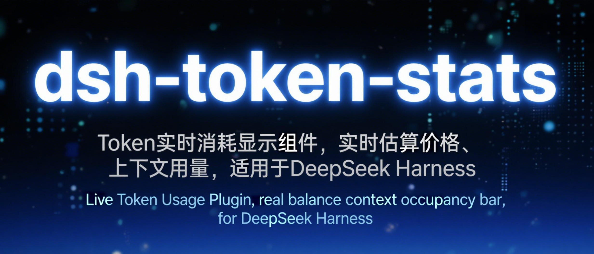
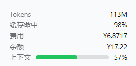

<p align="center">
  <a href="LICENSE"></a>
  <a href="#"></a>
  <a href="#"></a>
  <a href="https://github.com/Ouye-UE/dsh-token-stats/stargazers"></a>
</p>

# dsh-token-stats

[DeepSeek Harness](https://github.com/deepseek-ai/deepseek-harness) 的**常驻侧边栏插件**：在左侧边栏底部（`sidebar.footer.action`）显示实时 Token 消耗面板。

部署一次，之后每次启动自动加载。无需批准、无需构建。

## 面板



文本示意：

```
Tokens    80.0M                ← 实时，紧凑 K/M
缓存命中  62%
费用      ¥3.97                ← 悬停：分桶明细
系统调用  3.5K · ¥0.01          ← 非零时才显示
余额      ¥88.50               ← 悬停：充值/赠送构成
上下文    [████████░░]  62%    ← 绿/黄/红随占用率变化
─────────────────────────────
[Cordis plugins]
[Settings]
```

## 功能

| 行 | 回答 | 数据来源 |
| --- | --- | --- |
| **Tokens** | 这个会话消耗了多少 token？ | `tokenUsage` 投影（实时、按会话） |
| **缓存命中** | 上下文缓存帮我省了多少？ | 计费输入中缓存读的占比 |
| **费用** | 这个会话大概花了多少钱？ | 按请求折叠——每笔用量按自己的模型 × 北京时间时段计价 |
| **系统调用** | 隐藏 LLM 调用（标题/压缩） | `llm/stream` 拦截器 |
| **余额** | 账户还剩多少钱？ | 官方 `GET /user/balance`，服务端持钥 |
| **上下文** | 上下文窗口还有多少余量？ | `contextPressure` 投影 |

亮点：

- **精确混合计价** —— 用量按「模型 × 价格时段」折叠：flash 用量按 flash 价、pro 按 pro 价；每笔请求按其发生时刻归类（峰谷价生效前用现行价，之后高峰 9-12/14-18、其余空闲）。悬停「费用」行可看分桶明细。
- **真实账户余额** —— 用部署的 `DEEPSEEK_API_KEY` 在服务端调官方余额接口，密钥不出 Host。
- **与原生统计同源** —— Tokens / 缓存命中 / 上下文来自 Harness 自带投影（与官方统计行同一数据源），不会漂移。

## 原理

双面包，零第三方 npm 依赖（只消费 Harness 宿主服务）：

```
lib/index.js   宿主半边     GET /token-stats/stats?sessionId=<id>
                · 余额（官方接口，30s 缓存）
                · 按模型×时段折叠会话事件日志
                · llm/stream 拦截隐藏系统调用

lib/client.js  浏览器半边   sidebar.footer.action 面板
                · 投影经 useSessions → projectionValues 实时读取
                · 每 2s 轮询 stats 路由
```

## 安装

1. 把本包拷入 web profile 的 node_modules：

   ```powershell
   # 例如 <DSH_HOME> = C:\Users\you\.dsh
   Copy-Item .\dsh-token-stats "<DSH_HOME>\profiles\node_modules\dsh-token-stats" -Recurse
   ```

2. 在 `<DSH_HOME>/profiles/web/cordis.patch.yml` 加一行：

   ```yaml
   - insert:
       - id: token-stats
         name: dsh-token-stats
   ```

   （见 `examples/cordis.patch.yml`。）

3. 重启 DSH（`dsh web`）。之后自动加载。

## 配置

编辑 `lib/client.js`：

```js
const CONFIG = {
  model: 'deepseek-v4-flash',   // 未知模型 id 的回退价目表
  newPricingFrom: '2026-08-17', // 峰谷价生效日期（北京时间）
};

const PRICES = {
  'deepseek-v4-flash': {
    current: { hit: 0.02, miss: 1,    out: 2   },
    offPeak: { hit: 0.05, miss: 1.5,  out: 4.5 },
    peak:    { hit: 0.10, miss: 3.0,  out: 9.0 },
  },
  'deepseek-v4-pro': {
    current: { hit: 0.025, miss: 3,    out: 6   },
    offPeak: { hit: 0.15,  miss: 4.5,  out: 13.5 },
    peak:    { hit: 0.30,  miss: 9.0,  out: 27.0 },
  },
};
```

官方调价时按实际修改 `PRICES`（单位：元/百万 tokens）。

余额行需要部署的 `DEEPSEEK_API_KEY` 凭证（`<DSH_HOME>/.credentials.yaml` 或环境变量）——与 Harness 自身的 LLM 路由同一份凭证，包内不存任何密钥。

## 局限

- **费用是估算值，非账单**，权威数字以 DeepSeek 平台为准。
- **搜索触发的用量不可见**：DeepSeek 搜索提供方走原生 API 直连、绕过会话日志，任何 Harness 插件都拿不到其 token 用量（DSH 产品局限）。标题/压缩类调用已由 `llm/stream` 拦截器覆盖。
- 侧边栏收起成窄条（56px rail）时面板自动隐藏。

## 开发

零构建——`lib/index.js` 与 `lib/client.js` 就是部署产物。本地语法检查：

```bash
node --check lib/index.js
node --check lib/client.js
```

CI 在每次推送时执行同样的检查。

## License

[MIT](LICENSE) © 2026 Ouye-UE
